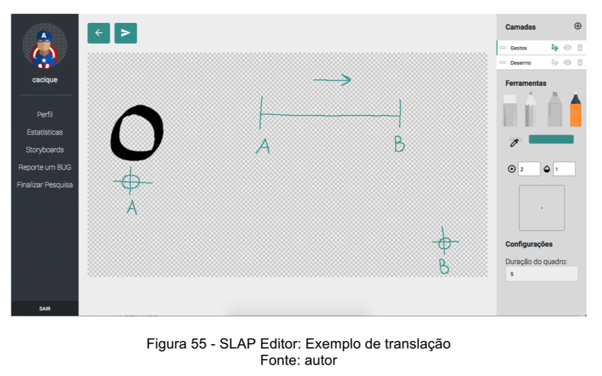
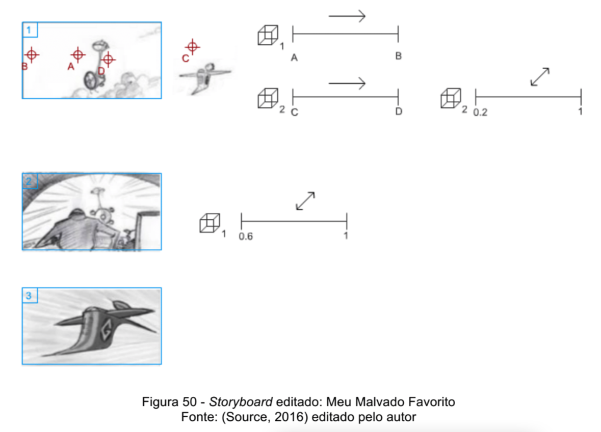
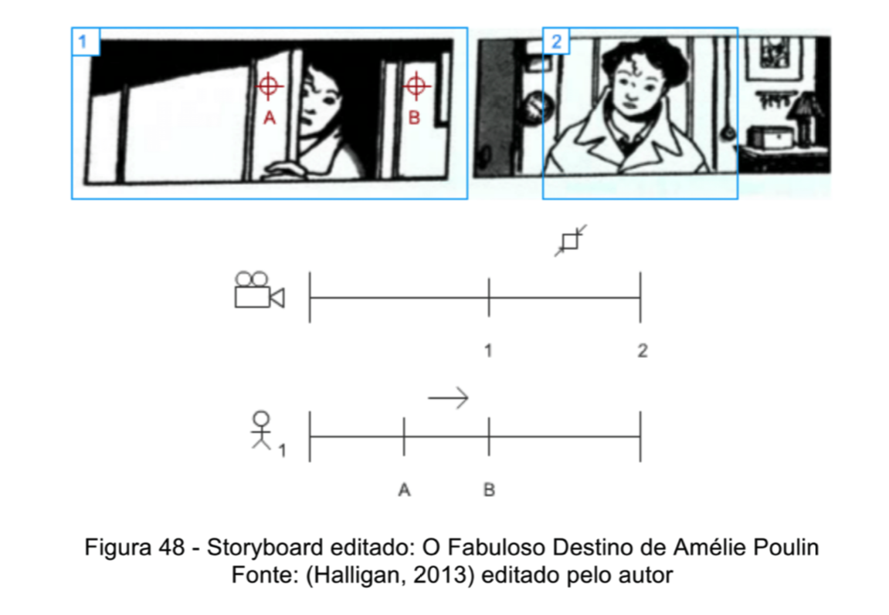

# slap
Storyboard Language for Animation Programming

This repository contains the work made for my Doctoral Thesis (2013-2017) about a new Visual Language for storyboards.
It was made using PHP for the backend and HTML, CSS and JS for the frontend.

***Abstract**
The phase of pre-production of a digital animation is mainly characterized by the documentation of the film's production details. This step is essential for understanding the idea of the film and the technique of the proposition being used. This work proposes a new approach to the main pre-production document: the storyboard. It is proposed a new visual language for semi automated generation of an animatics.*

## SLAP Editor

## SLAP usage

